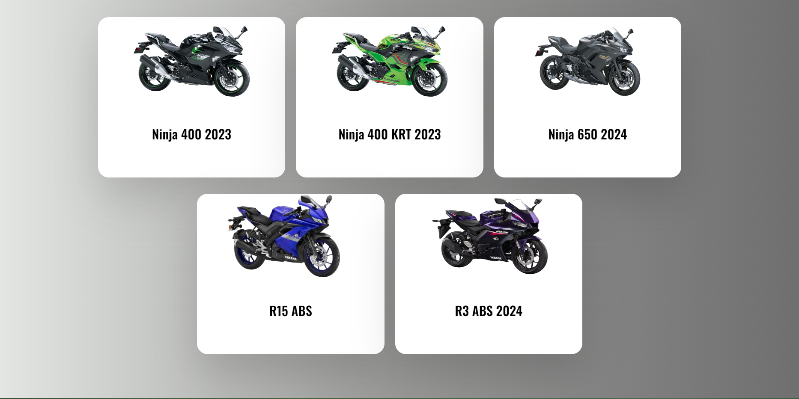
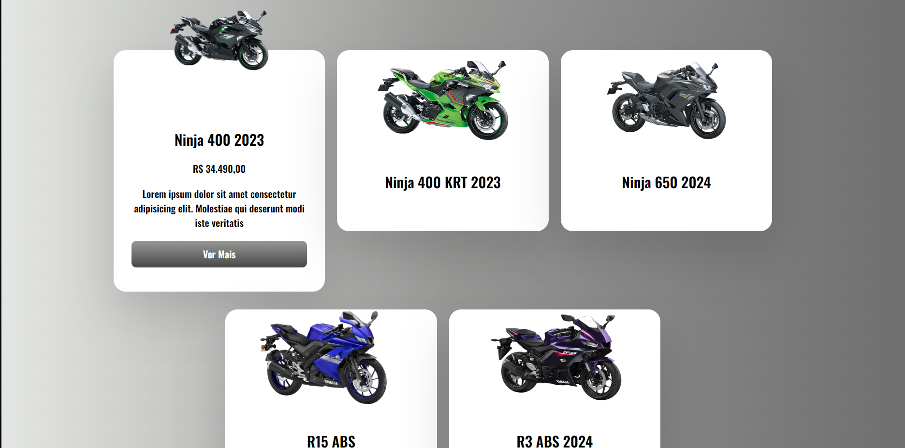

# Card Design
 
🏍️ Praticando card design com minhas motos favoritas.

• Desenvolvido com: HTML, CSS 
 
• Ferramentas utilizadas:
 
<ul>
 <li>favicon</li>
 <li>GIMP</li>
 <li>color adobe</li>
</ul>
• Resultado:

